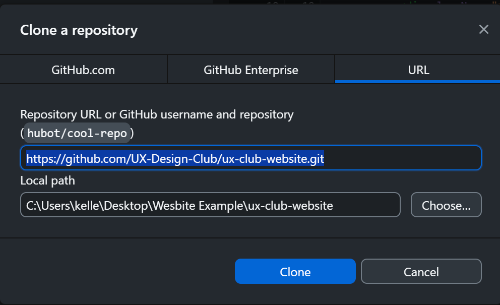
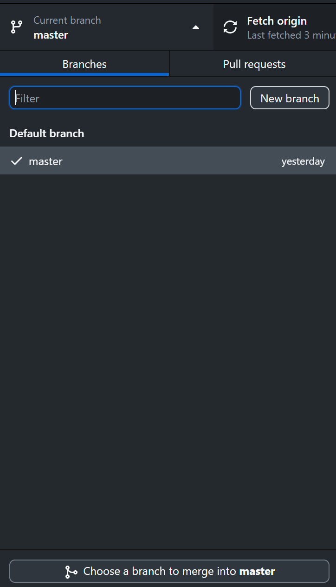

# Welcome!
Thank you for taking time to contribute to the official website of the UX Design Club at the University of Texas at Arlington! This project is written in [Next.js](https://nextjs.org/) and [Tailwind CSS](https://tailwindcss.com/) as a way to give students at UTA a way to learn an industry standard model for web app development. This project builds on the principles learned in CTEC 2350 and 3350 and assumes a base level knowledge of [Visual Studio Code](https://code.visualstudio.com/). If you need help editing the project, feel free to ask any questions in the [Discord](https://discord.gg/6qNqhn383m).

## How to Join the UX Design Club
To join this club, please contact us at uxdesignclub.uta@gmail.com and we will get back to you as soon as we can!

# Editing the Project
In order to keep this project as clean as possible, we ask that you follow a few procedures as you edit this project. This guide is written for use with [GitHub Desktop]() but you can do this with the [command terminal](https://docs.github.com/en/github-cli/github-cli/quickstart) as well!

## 1. Clone the Repository to your Local Computer
In the GitHub app, press the `Add` button and select "Clone Repository...". Then select the folder that you want the project to clone to (must be an empty folder) and paste the Repository URL: https://github.com/UX-Design-Club/ux-club-website.git. You can also find this URL by navigating to the green "<> Code" button on the repository website.

After cloning the repository, you can now edit the code!

## 2. Create a Branch for Your Changes
In the GitHub desktop app, create a new branch. Branches are necessary to publish your changes onto the main site. For branch naming, please follow this guide on [conventions](https://dev.to/varbsan/a-simplified-convention-for-naming-branches-and-commits-in-git-il4) for the best results. 

## 3. Open the Local Host to View Your Changes
In Next.js, you will need to open a localhost to view your changes.

Press ctrl + ` to open the command terminal, type ``npm run dev``, and hit enter to start the local host. You can now navigate to [http://localhost:3000](http://localhost:3000) with your browser to see the results.

## 4. Edit the Codebase

You can start editing the page by modifying `app/page.tsx`. The page auto-updates as you edit the file. This is your new index page that displays your home page! Other pages can be found through their routes (the about page is found at `app/about/page.tsx`, the contact page is found at `app/contact/page.tsx`, etc.). In Next.js, pages contain custom elements called 'components'. Components are a way to decentralize and reuse your code throughout your project.

## 5. Deployment 
### Deploying Changes
To make your change to the site impact the site on all devices, simply open a [pull request](https://docs.github.com/en/pull-requests/collaborating-with-pull-requests/proposing-changes-to-your-work-with-pull-requests/creating-a-pull-request) from your branch to the `master` branch. After the pull request is approved by the webmaster, this change will be merged with the master branch.

### Automatic Updates Through [Netlify](https://app.netlify.com/sites/uxdesignclub-uta/overview)
For now, we are using Netlify to deploy the website to [uxdesignclub.uta.netlify.app](https://uxdesignclub-uta.netlify.app/). Any changes to the GitHub that are pushed to the main branch will automatically update on the website through Netlify. Update logs will be sent to the UX Club email when the updates are posted.

# Resources
### Next.js
To learn more about Next.js, take a look at the following resources:

- [Documentation](https://nextjs.org/docs)
- [Learn Next.js](https://nextjs.org/learn)
- [Video Example](https://www.youtube.com/watch?v=ZVnjOPwW4ZA)

### Tailwind CSS
To learn more about Tailwind CSS, take a look at the following resources:

- [Documentation](https://tailwindcss.com/docs/installation)
- [Component Examples](https://tailwindui.com/components)

### Netlify
To learn more about Netlify, take a look at the following resources:

- [Documentation](https://docs.netlify.com/)

### GitHub
To learn more about GitHub, take a look at the following resources:

- [Hello World Tutorial](https://docs.github.com/en/get-started/start-your-journey/hello-world)
- [GitHub Desktop](https://docs.github.com/en/desktop/overview/getting-started-with-github-desktop)

### VS Code
To learn more about Visual Studio Code, take a look at the following resources:

- [Setup Guide](https://code.visualstudio.com/docs/introvideos/basics)
- [Version Control in VS Code](https://code.visualstudio.com/docs/introvideos/versioncontrol)
- [Tailwind Intellisense](https://marketplace.visualstudio.com/items?itemName=bradlc.vscode-tailwindcss)
